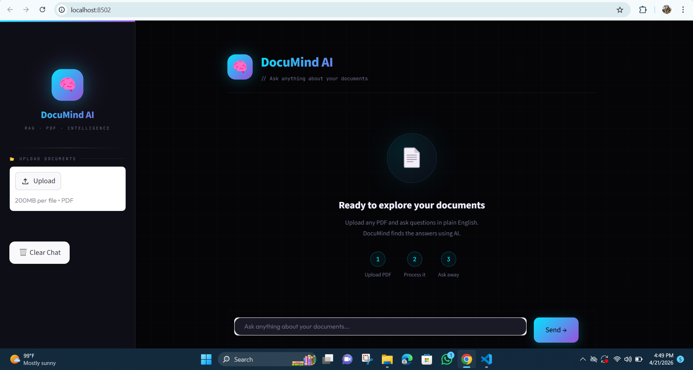
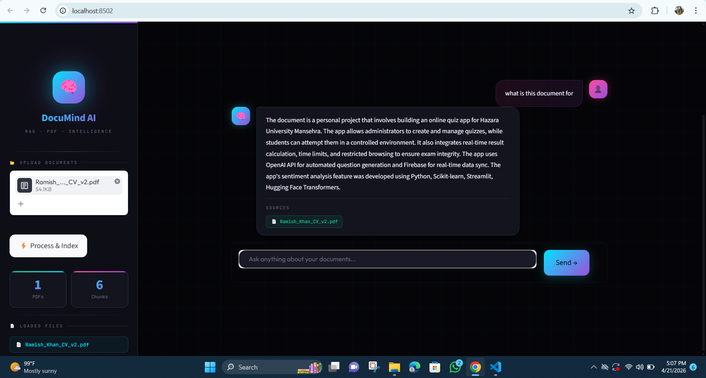

# 🧠 DocuMind AI — PDF RAG Chatbot

> Upload any PDF and chat with it using AI — powered by HuggingFace (100% Free!)

---

## ✨ Features

- 📄 Upload multiple PDFs at once
- 🔍 Smart semantic search with FAISS vector database
- 🤖 Free AI model (no API key needed!)
- 💬 Clean, dark-themed chat UI
- 📌 Source citations with every answer

---

## 🛠️ Tech Stack

| Layer | Tool |
|-------|------|
| UI | Streamlit |
| PDF Parsing | PyPDF2 |
| Text Chunking | LangChain |
| Embeddings | HuggingFace `all-MiniLM-L6-v2` |
| Vector DB | FAISS (local) |
| LLM | HuggingFace `flan-t5-base` |

---

## 🚀 Setup & Run

### 1. Clone or Download the Project

```bash
cd pdf-chatbot
```

### 2. Create Virtual Environment

```bash
python -m venv venv

# Windows:
venv\Scripts\activate

# Mac/Linux:
source venv/bin/activate
```

### 3. Install Dependencies

```bash
pip install -r requirements.txt
```

> ⚠️ First run will download AI models (~500MB). After that it's fast!

### 4. Run the App

```bash
streamlit run app.py
```

## 📸 Screenshots

### Upload & Chat Interface


### Chat Response Example



### 5. Open in Browser

```
http://localhost:8501
```

---

## 📂 Project Structure

```
pdf-chatbot/
│
├── app.py                  # Main Streamlit app
├── requirements.txt        # All dependencies
├── README.md               # This file
│
└── utils/
    ├── __init__.py
    ├── pdf_processor.py    # PDF reading & chunking
    ├── embeddings.py       # HuggingFace embeddings + FAISS
    └── rag_pipeline.py     # LLM + RAG chain
```

---

## 💡 How It Works

```
PDF Upload
    ↓
Text Extraction (PyPDF2)
    ↓
Text Chunking (LangChain)
    ↓
Embeddings (HuggingFace)
    ↓
FAISS Vector Store
    ↓
User Question
    ↓
Similarity Search (Top 4 chunks)
    ↓
LLM Answer (flan-t5-base)
    ↓
Response + Source Files
```

---

## 🔧 Customization

- **Better answers?** Change `LLM_MODEL` in `rag_pipeline.py` to `google/flan-t5-large`
- **Faster embeddings?** Already using the fastest free model
- **More chunks?** Increase `k` in `search_kwargs` in `rag_pipeline.py`

---

## 👤 Author

**Ramish Khan** — AI Engineer  
[GitHub](https://github.com/ramishkhan) | kramish033@gmail.com

---

> 💼 Built as a portfolio project to demonstrate RAG, LangChain, and HuggingFace skills.
